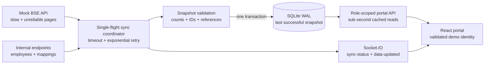

# Architecture: Internal Operations Portal

## Why this design

- BSE data is pulled in pages so every HTTP request stays below the 25-second client timeout even when a complete pull takes about ten minutes. Each page is retried up to five times with capped exponential backoff.
- A single-flight coordinator rejects overlapping manual or scheduled pulls. All pages and internal records are held outside the database until counts, unique identifiers, roles, and cross-record references validate.
- SQLite stores only complete snapshots. Foreign keys and one transaction ensure a failed insert rolls back, while WAL mode lets screens continue reading the previous snapshot during a refresh.
- Portal requests never wait for BSE. They read the cache, and a successful commit emits `data-updated`; open screens then re-fetch through the role-scoped API. Failed pulls emit an error but do not emit a data update.
- The assessment role selector sends `X-Employee-Id`. The server looks up that employee and derives the role; relationship managers cannot request another employee's clients or incentives, and only management can trigger sync.

## Failure invariants

1. Timeouts, HTTP errors, malformed metadata, duplicates, missing pages, or invalid references cannot replace the cache.
2. At most one synchronization mutates the cache in a process.
3. `data-updated` is emitted only after a committed snapshot and successful sync log entry.
4. The latest successful timestamp is reported separately from the latest failed attempt so the UI can label stale data accurately.

## At 100× volume

Replace SQLite with PostgreSQL and connection pooling, move sync execution to a durable queue with a distributed lock, use source change tokens for incremental ingestion, and persist versioned staging snapshots before a short promotion transaction. Add server-side cursor pagination and aggregate endpoints to the portal API, virtualize large tables, and horizontally scale stateless API/WebSocket nodes through a shared event bus such as Redis.
